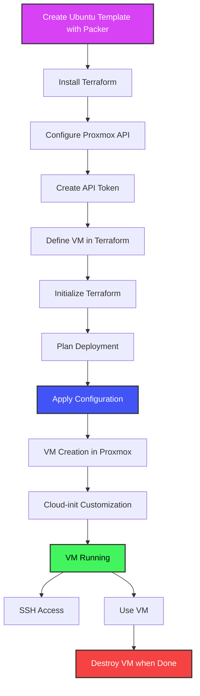

# Effortless VM Deployment with Terraform Proxmox: A Step-by-Step Guide

Are you tired of manually clicking through Proxmox's UI just to spin up a VM? It's slow, error-prone, and nearly impossible to scale when you need multiple machines. In this comprehensive guide, I'll show you how to automate Ubuntu 24.04 VM deployments using Terraform and Proxmox, building on the template we created in our previous tutorial.

## Introduction to Terraform and Proxmox

Terraform and Proxmox form a powerful combination for automating virtual machine deployment and management. This integration brings the efficiency and scalability of infrastructure as code to your virtualization environment, whether it's a home lab or enterprise setup.

### Workflow Overview

The following diagram illustrates the workflow for deploying VMs with Terraform and Proxmox:



This automated workflow drastically reduces deployment time and ensures consistency across your infrastructure.

Terraform is an open-source infrastructure as code (IaC) tool that enables you to define and provision infrastructure using a declarative configuration language. It allows you to manage various cloud services, virtualization platforms, and other infrastructure through a consistent workflow. With Terraform, you describe your desired infrastructure state in configuration files, and Terraform handles the rest—creating, modifying, or destroying resources as needed.

Proxmox Virtual Environment (Proxmox VE) is an open-source server virtualization management platform that combines KVM hypervisor and LXC containers, software-defined storage and networking functionality, on a single solution. Its comprehensive API makes it perfect for automation via tools like Terraform.

The Proxmox provider for Terraform bridges these two technologies, allowing you to define VMs in code and have them automatically deployed to your Proxmox server. This approach offers several advantages:

- **Repeatability**: Deploy identical VMs consistently every time
- **Version Control**: Track infrastructure changes with Git
- **Scalability**: Easily deploy multiple VMs in parallel
- **Documentation**: Self-documenting infrastructure via code
- **Reduced Human Error**: Eliminate point-and-click mistakes
- **Time Savings**: Deploy VMs in minutes instead of hours

## Setting Up Terraform

Before diving into VM deployment, you'll need to set up Terraform and configure it to work with Proxmox. Here's how to get started:

### Installing Terraform

For Ubuntu/Debian systems, the process is straightforward:

```bash
# Add HashiCorp GPG key
curl -fsSL https://apt.releases.hashicorp.com/gpg | sudo apt-key add -

# Add HashiCorp repository
sudo apt-add-repository "deb [arch=amd64] https://apt.releases.hashicorp.com $(lsb_release -cs) main"

# Update and install Terraform
sudo apt update && sudo apt install terraform
```

Verify the installation with:

```bash
terraform version
```

You should see output like:
```
Terraform v1.5.7
```

### Initializing Terraform

Create a directory for your Terraform configuration:

```bash
mkdir -p ~/terraform-proxmox
cd ~/terraform-proxmox
```

Initialize Terraform in this directory:

```bash
terraform init
```

This command prepares your working directory for use with Terraform, installing any required providers and setting up the backend.

## Configuring Proxmox API

The magic behind this automation is the Proxmox API, which allows Terraform to communicate with your Proxmox server. Let's set it up properly:

### Creating a Dedicated API User

While you can use the root account, it's better security practice to create a dedicated user for API access:

1. Log into the Proxmox web UI
2. Navigate to Datacenter → Permissions → Users
3. Add a new user (e.g., "terraform")
4. Assign appropriate roles (at minimum PVEVMAdmin for VM management)
5. Create API tokens for this user

### Generating an API Token

API tokens provide a secure way to authenticate with the Proxmox API:

1. Navigate to Datacenter → Permissions → API Tokens
2. Add a new token for your user
3. Decide whether to enable "Privilege Separation" (usually not needed for home labs)
4. Save the token ID and secret somewhere secure

This API token will be used in your Terraform configuration to authenticate with Proxmox.

## Authentication with Proxmox

Terraform needs to authenticate with your Proxmox server. There are multiple ways to handle this:

### API Token Method (Recommended)

The API token approach is more secure and doesn't require storing your Proxmox password in plain text:

```terraform
provider "proxmox" {
  endpoint  = "https://proxmox.example.com:8006"
  api_token = "user@pam!token_name=token_secret"
  insecure  = true  # Only for self-signed certificates in home labs
}
```

In our example, we're using variables to keep sensitive information out of our main configuration:

```terraform
provider "proxmox" {
  endpoint  = var.proxmox_api_url
  api_token = "${var.proxmox_api_token_id}=${var.proxmox_api_token_secret}"
  insecure  = true
}
```

These variables are then defined in separate files:

```terraform
# terraform.tfvars
proxmox_api_url = "https://192.168.1.95:8006"

# secrets.tfvars (should be kept out of version control)
proxmox_api_token_id     = "root@pam!terraform"
proxmox_api_token_secret = "021cb58d-aed0-4104-b448-6b20ab461008"
```

## Creating a VM with Terraform

Now comes the exciting part – defining your VM in code. Let's break down the essential components:

### Provider Configuration

First, we need to specify which Terraform provider we're using. For Proxmox, we'll use the excellent `bpg/proxmox` provider:

```terraform
terraform {
  required_providers {
    proxmox = {
      source  = "bpg/proxmox"
      version = "0.77.1"
    }
  }
}
```

### VM Resource Definition

Here's where we define our VM's specifications:

```terraform
resource "proxmox_virtual_environment_vm" "ubuntu_vm" {
  name        = var.vm_name
  description = "Terraform-managed Ubuntu 24.04 VM"
  tags        = ["terraform", "ubuntu"]
  node_name   = var.target_node

  # Use template created by Packer
  clone {
    vm_id = 9001
    full  = true
  }

  agent {
    enabled = true
  }

  cpu {
    cores = var.vm_cores
    type  = "host"
  }

  memory {
    dedicated = var.vm_memory
  }

  network_device {
    bridge = var.network_bridge
  }

  disk {
    interface    = "scsi0"
    size         = var.disk_size
    file_format  = "raw"
    datastore_id = var.disk_storage
  }

  operating_system {
    type = "l26"
  }

  # Cloud-init configuration omitted for brevity...
}
```

This defines a VM that will be cloned from our pre-created template (VM ID 9001), with customizable CPU, memory, and disk resources.

### Cloud-Init Configuration

Cloud-init is a powerful tool for initializing cloud instances, and it works great with Proxmox too. Here's how we configure it:

```terraform
initialization {
  ip_config {
    ipv4 {
      address = var.static_ip_address
      gateway = var.gateway
    }
  }

  dns {
    servers = var.dns_servers
    domain  = var.dns_domain
  }

  user_account {
    keys     = [var.ssh_public_keys]
    username = "ubuntu"
    password = var.vm_password
  }
}
```

This block allows us to:
- Configure networking (DHCP or static IP)
- Set DNS servers and domain
- Inject SSH keys for secure access
- Set user password (though SSH keys are preferred)

### Variables for Customization

Instead of hardcoding values, we use variables to make our configuration flexible:

```terraform
variable "vm_name" {
  description = "Name of the VM"
  type        = string
  default     = "ubuntu-vm"
}

variable "vm_cores" {
  description = "Number of CPU cores"
  type        = number
  default     = 2
}

# And so on...
```

These variables can then be set in a `terraform.tfvars` file:

```terraform
vm_name     = "multipurpose"
target_node = "proxmox"
vm_cores    = 8
vm_memory   = 8192  # 8GB RAM
disk_size   = "100" # 100GB
```

## Executing the Deployment

With our configuration ready, let's deploy our VM:

### Manual Deployment

You can run Terraform commands directly:

```bash
terraform init
terraform plan -var-file=terraform.tfvars -var-file=secrets.tfvars -out=tfplan
terraform apply tfplan
```

### Automated Deployment Script

For convenience, I've created a build.sh script that handles initialization, planning, and application in one go:

```bash
./build.sh
```

The script also provides options:
- `-p` or `--plan`: Only create a plan without applying
- `-d` or `--destroy`: Destroy the infrastructure

## Demo: From Zero to VM in Minutes

Let me walk you through a real-world deployment to show how fast and efficient this approach is:

1. **Start State**: I have a fresh Proxmox server with the Ubuntu 24.04 template (VM ID 9001) that we created in the previous tutorial.

2. **Run the Build Script**: The script initializes Terraform, creates a plan, and applies it:

   ```bash
   ./build.sh
   ```

3. **Watch the Magic**: Terraform communicates with Proxmox, clones our template, and customizes it according to our specifications. This typically takes about 1-2 minutes, compared to 5-10 minutes for a manual installation.

4. **Verify the Deployment**: In the Proxmox UI, we can see our new VM with the specified resources:
   - Name: multipurpose
   - CPU: 8 cores
   - Memory: 8GB
   - Disk: 100GB

5. **Access the VM**: Once deployed, we can SSH into our new VM using the injected SSH key:

   ```bash
   ssh ubuntu@192.168.1.96
   ```

6. **Verify Customization**: Inside the VM, we can see that it has all the pre-installed packages from our template (Docker, jq, curl, vim, zip, unzip) plus our custom configurations.

7. **Clean Up**: If needed, we can destroy the VM just as easily:

   ```bash
   ./build.sh -d
   ```

## Customizing the VM

One of the greatest advantages of this approach is how easy it is to customize your VMs. Let's explore some common customizations:

### Resource Allocation

Adjusting CPU, memory, and disk resources is as simple as changing variables:

```terraform
vm_cores  = 8       # Number of CPU cores
vm_memory = 8192    # RAM in MB (8GB)
disk_size = "100"   # Disk size in GB
```

### Networking Configuration

You can use DHCP or configure static IPs:

```terraform
# DHCP configuration
initialization {
  ip_config {
    ipv4 {
      dhcp = true
    }
  }
}

# Static IP configuration
initialization {
  ip_config {
    ipv4 {
      address = "192.168.1.96/24"
      gateway = "192.168.1.1"
    }
  }
}
```

### User Access

Secure your VM by injecting SSH keys and setting a strong password:

```terraform
user_account {
  keys     = ["ssh-rsa AAAAB3NzaC1yc2EAAA..."]
  username = "ubuntu"
  password = var.vm_password
}
```

## Deploying Multiple VMs

Scaling from one VM to many is straightforward with Terraform. Here's how you can deploy multiple VMs:

### Using Count

For identical VMs with sequential naming:

```terraform
resource "proxmox_virtual_environment_vm" "ubuntu_vm" {
  count       = 3
  name        = "${var.vm_name}-${count.index + 1}"
  # Rest of the configuration...
}
```

### Using For_each

For VMs with different configurations:

```terraform
variable "vms" {
  type = map(object({
    cores   = number
    memory  = number
    ip      = string
  }))
  default = {
    "web" = {
      cores   = 2
      memory  = 4096
      ip      = "192.168.1.101/24"
    },
    "db" = {
      cores   = 4
      memory  = 8192
      ip      = "192.168.1.102/24"
    }
  }
}

resource "proxmox_virtual_environment_vm" "ubuntu_vms" {
  for_each    = var.vms
  name        = each.key
  
  cpu {
    cores = each.value.cores
  }
  
  memory {
    dedicated = each.value.memory
  }
  
  initialization {
    ip_config {
      ipv4 {
        address = each.value.ip
      }
    }
  }
  
  # Rest of the configuration...
}
```

This approach makes it simple to deploy and manage entire environments with different VM specifications.

## Troubleshooting Common Issues

Like any automation, you might encounter issues. Here are solutions to common problems:

### API Connection Issues

If Terraform can't connect to your Proxmox server:

- Check that the API URL is correct and accessible
- Verify API token permissions
- For self-signed certificates, ensure `insecure = true` is set

### Clone Failures

If VM cloning fails:

- Make sure the template VM exists and has the correct ID
- Check storage permissions
- Verify the template is not running

### Cloud-Init Problems

If cloud-init customizations aren't applying:

- Ensure the Proxmox VM has the cloud-init drive properly configured
- Check that the qemu-guest-agent is installed in the template
- Verify the cloud-init syntax in your Terraform configuration

## Advanced Proxmox Provider Configuration

The `bpg/proxmox` provider offers many advanced options for fine-tuning your VMs:

### Boot Order Configuration

```terraform
operating_system {
  type = "l26"
}

boot_order = ["scsi0", "ide2"]
```

### Serial Console

For better compatibility with some Linux distributions:

```terraform
serial_device {}
```

### VGA Configuration

For desktop environments:

```terraform
vga {
  type = "std"
  memory = 32
}
```

## Conclusion and Next Steps

Deploying Ubuntu 24.04 VMs in Proxmox using Terraform dramatically simplifies and accelerates the process. Instead of clicking through the UI for every deployment, you can define your infrastructure in code and deploy it consistently every time.

This approach saves time, reduces errors, and allows you to version-control your infrastructure. With the basics covered in this guide, you now have a solid foundation for automating your Proxmox infrastructure.

### Where to Go From Here

- **Kubernetes Cluster**: Use this approach to deploy a multi-node Kubernetes cluster
- **CI/CD Pipeline**: Integrate Terraform into your CI/CD workflow for automated environment provisioning
- **Configuration Management**: Combine with Ansible for complete VM lifecycle management
- **Monitoring Setup**: Deploy monitoring agents as part of your VM provisioning

## Demo Video

<iframe width="560" height="315" src="YOUR_VIDEO_URL_HERE" frameborder="0" allow="accelerometer; autoplay; clipboard-write; encrypted-media; gyroscope; picture-in-picture" allowfullscreen></iframe>

In this video, I demonstrate the entire process from start to finish:
1. Starting with no VMs
2. Using the Ubuntu 24.04 template created in our previous tutorial
3. Running our Terraform configuration
4. Deploying a fully configured VM in less than 2 minutes
5. SSHing into the new VM to verify everything works
6. Destroying the VM when we're done

The entire process takes just a few minutes, compared to the manual approach that could take 5-10 times longer.

## Resources

- [Terraform Documentation](https://www.terraform.io/docs)
- [Proxmox Provider Documentation](https://registry.terraform.io/providers/bpg/proxmox/latest/docs)
- [GitHub Repository with Complete Code](https://github.com/yourusername/terraform-proxmox-ubuntu)
- [Packer Tutorial for Creating Ubuntu Templates](YOUR_PREVIOUS_BLOG_POST_URL)

Ready to automate your Proxmox infrastructure? Get started with Terraform today and say goodbye to manual VM deployments forever! 